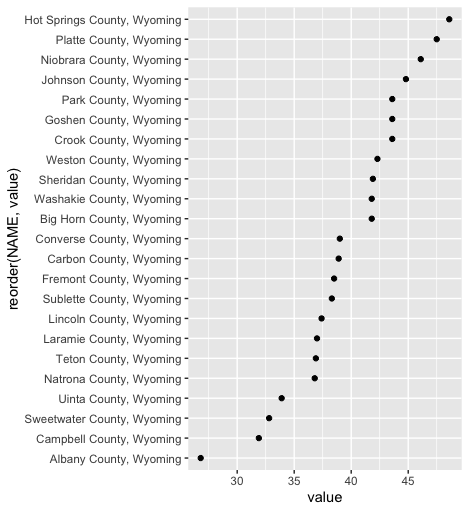

# Chris Seeger's DSPG Journal 2022

## Profile
- Originally from North Dakota
- BLA and BS in Environmental Design; North Dakota State University - yes that top football school - Go Bison!
- MLA; Iowa State University - this is a terminal degree so no calling me Dr. - that would be my dad - ISU Veterinary grad.
- Licensed as a Professional Landscape Architect and certified as a GIS Professional (GISP)
- Passionate about Spatial Data (including networks, volunteered geographic information) and sharing these technologies with communities and students.
- Research has focused on physical activity and the built environment
- Software interests include: open-source software, QGIS, user-generated data, Leaflet, OpenStreetMap, R, JavaScript, SQL
- Hobbies: Woodworking, board games (Terraforming Mars, Catan, Carcassonne), Photography, messing around with attempting to play guitar, harmonica and most recently an old accordion …

## Daily Journal of things learned or created
Over the course of the DSPG summer program I have worked on a variety of things each day. Following is a summary.

### Week 1

Managing Data Camp Teams and reviewing assessments

This R script will create a plot showing median age for wach county in Wyoming. I first tried to use Iowa but need to modify GGPLOT to allow for 99 counties!

### Week 2
