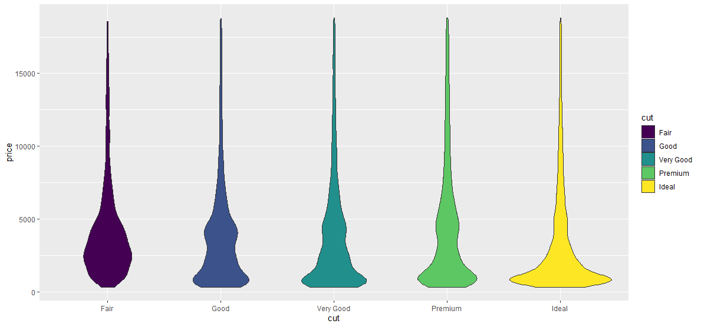
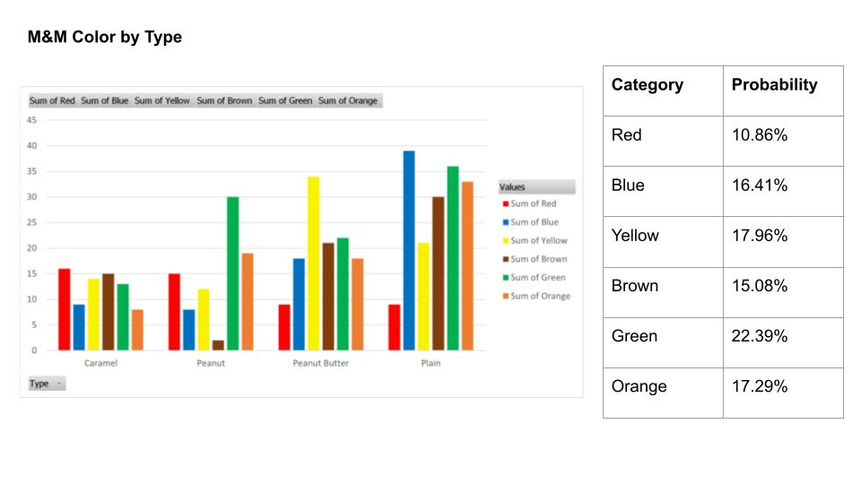
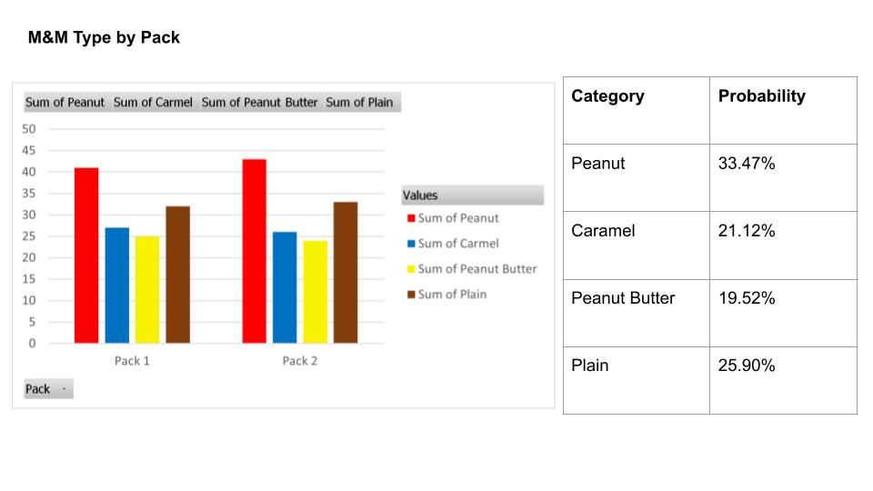

# Joel Martin's DSPG Journal 2022

## Profile

- Originally from Ohio
- Education:
	- Attended Columbus State Community College (CSCC)
	- Transferred to online Western Governors University (WGU)
		- Obtained CompTIA A+ and Network+ certifications
	- Transferred to Iowa State University (ISU)
		- Data Science undergraduate with an emphasis in big data
- Work Experience:
	- Target Corporation - Presentation, Salesfloor, Guest Service
	- Data Science for the Public Good 2022

- Hobbies:
	- Hiking (Primarily at Walnut Woods and Brown's Woods)
	- Skateboarding
	- Gaming (Satisfactory, Overwatch)

<br clear="right"/>

## Weekly Journal
The following is a brief summary of things I learned or accomplished each week during the DSPG 2022 program.

## Week 1
Using courses through Data Camp I learned about various resources and tools in R.
One of the new things I learned about were violin plots.
Using the built in diamonds data, I created the following plot showing the use of a violin plot to display pricing 
compared to the cut of a diamond.



One activity we did this week was, given a data set, to create some sort of insight using the program of our choice in an hour. 
We were given an M&M's dataset containing the counts of the number of M&M type bags and overall color counts from two variety bags of M&Ms. 
Using a PivotTable in Excel I created the following graphs showing the data in a bar graph and the calculated percentages for each category.





Another topic I learned about through Data Camp, watching, and reading information from Kyle Walker, was tidycensus.
tidycensus is a package in R that Kyle Walker built to make the U.S. census data easier to use.
As an activity, the DSPG 2022 team was given the task to find which Iowa county has the 5th lowest median household income,
according to the 2020 American Community Survey (ACS) data.
To accomplish this I used get_acs to access the ACS 2020 Iowa counties from B19013_001 which contains the median household data. Next I sorted by the estimate column by ascending and retunrned the 5th row.

```
library(tidycensus)
library(tidyverse)

state_income <- get_acs(
                  geography = "county",
                  variables = "B19013_001",
                  state = "IA",
                  year = 2020)

(state_income %>%
  arrange(estimate))[5,]
```

This returns Decatur as Iowa's 5th lowest median household income county from the 2020 ACS with a value of $48,154.

