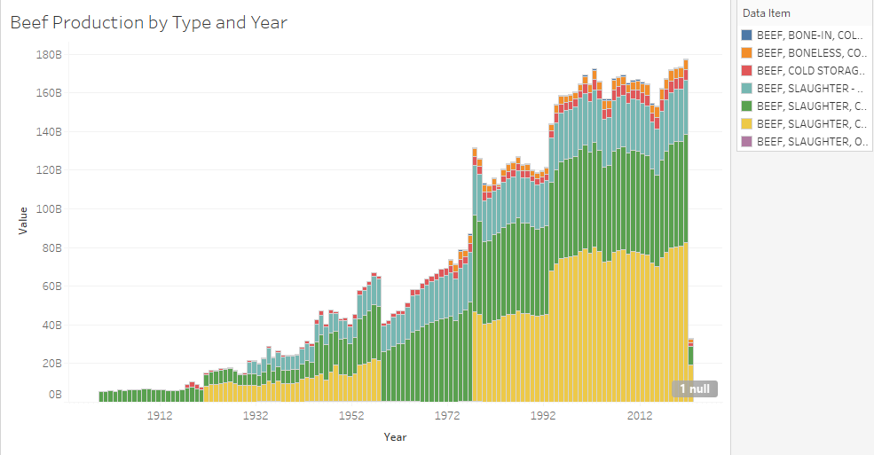
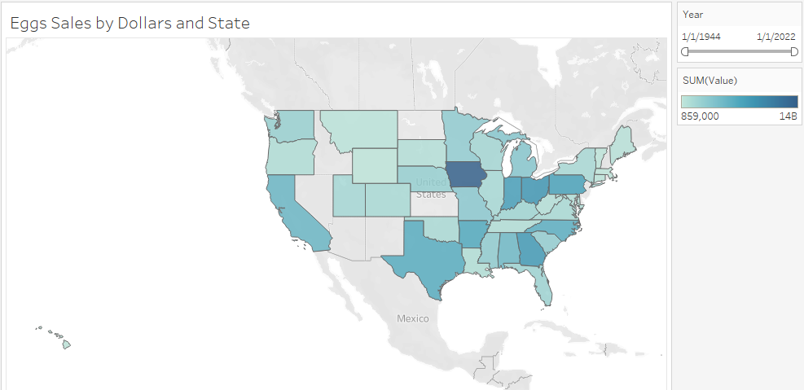

## Week 2

This week the DSPG team began working in their teams. I started the week working in my A team, DHR Disabilities.

I learned about the projects previous work and focused on the Disabilities section of the report that covered many different categories such as Finances and Education.

One main reoccuring topic I saw was lack of transportation options for the disabled. This was also a topic in sections analyzed by the other members of our team.

Another thing I learned more about this week was Tableau through DataCamp. Tableau is a program that allows you to import data from many different sources and easily create tables and graphs to better visualize data.

While working on my B team, AgMRC Interactive Commodity Reports, I used Tableau to create graphs representing different commodities we are interested in.

[Back to Week 1](https://github.com/DSPG-2022/DSPG/blob/main/Contributors/Joel_Martin/Week_1.md) - [Continue to Week 3](https://github.com/DSPG-2022/DSPG/blob/main/Contributors/Joel_Martin/Week_3.md)

[Return to Journal Beginning](https://github.com/DSPG-2022/DSPG/blob/main/Contributors/Joel_Martin/Journal.md)