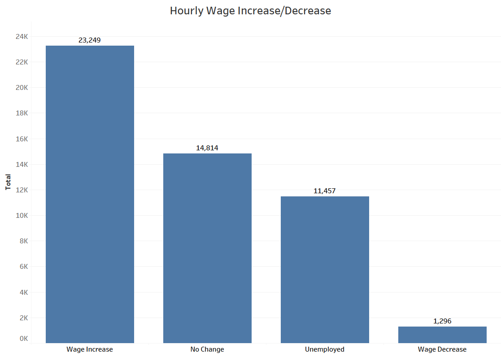

## Week 3

This week I continued working in my A and B day teams.

During my A team days I delved into the [IVRS data](https://data.iowa.gov/Vocational-Rehabilitation/Closed-Iowa-Vocational-Rehabilitation-Cases/gcya-t3y9). 
IVRS stands for Iowa Vocational Rehabilitation Services and it is their mission to provide expert, 
individualized services to Iowans with disabilities to achieve their independence through successful 
employment and economic support. The IVRS dataset provides information on closed cases where the individual 
(also referred to as client) received services from IVRS. The dataset includes cases closed after October 1, 2008.

Using this data I looked at a number of variables to try and see if we could learn anything from it.

One of my main findings was that the counties in Iowa with the highest number of cases overall was Polk and Linn counties.
According to the [2020 American Community Survey (ACS) data](https://www.iowa-demographics.com/counties_by_population) the counties 
with the highest populations in Iowa were also Polk and Linn counties. This aligns with what you would expect to find.

Another interesting find was that the IVRS program seems to be helping overall as many of the clients saw an increase
in wages when their case was closed.

Working in my B team this week I explored the USDA data furthur by trying out different ways to get the data into Tableau and also 
learning more about the various tools inside of Tableau.

One of the main commodities our team is working with is eggs. Using Tableau I created a dashboard that with the use of a playable time series
displays the total egg sales by state in map and bar chart format.

https://user-images.githubusercontent.com/69860783/174094919-96b78ad8-a5f6-431a-8343-c1678c07aeb5.mp4

I still need to find a few settings to improve this visual but starting out I thought it worked very nicely!

[Back to Week 2](https://github.com/DSPG-2022/DSPG/blob/main/Contributors/Joel_Martin/Week_2.md) - [Continue to Week 4](https://github.com/DSPG-2022/DSPG/blob/main/Contributors/Joel_Martin/Week_4.md)

[Return to Journal Beginning](https://github.com/DSPG-2022/DSPG/blob/main/Contributors/Joel_Martin/Journal.md)